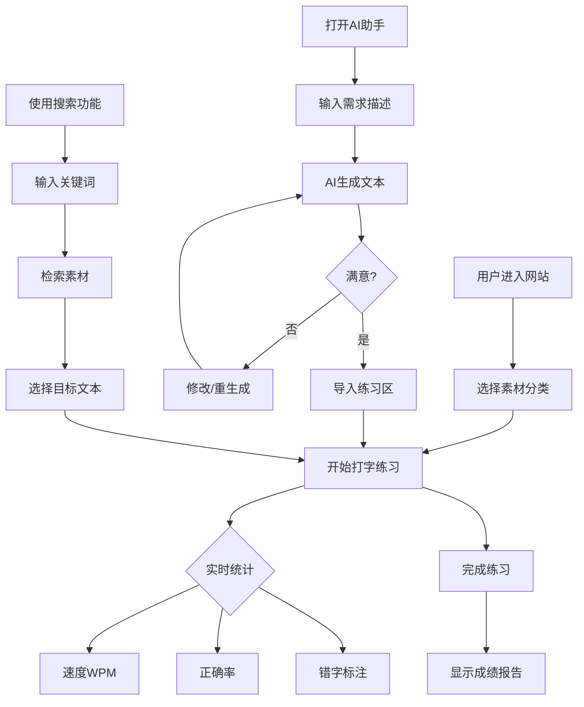

# 在线打字练习网站 - 产品需求文档 (PRD)

## 1. 产品概述
一款纯网页端打字练习工具，对标金山打字通完整训练体系，整合AI对话生成、站内检索、自定义内容生成一体化功能。主打治愈柔和界面 + 趣味化打字训练，开箱即用，无需安装。

**目标用户**：需要提升打字速度和准确率的用户、四六级备考学生、客服人员、文学爱好者

**核心价值**：通过AI实现无限拓展练习素材，支持持续迭代升级，提供差异化的打字训练体验

---

## 2. 核心功能

### 2.1 功能模块

1. **打字练习主区域**：实时显示原文、输入框、统计面板、错字标注、用时统计
2. **素材分类导航**：7大预设素材分类，一键切换
3. **AI万能生成助手**：对话式生成自定义打字素材
4. **全站搜索功能**：检索内置素材和AI生成内容

### 2.2 页面详情

| 页面名称 | 模块名称 | 功能描述 |
|---------|---------|---------|
| 主页面 | 打字练习区 | 实时显示原文、输入框、打字速度(WPM)、正确率、错字高亮、用时统计 |
| 主页面 | 素材分类导航栏 | 7大分类：小说段落、歌曲歌词、四六级作文、四六级翻译、四六级单词、影视剧台词、电商客服话术 |
| 主页面 | AI生成助手弹窗 | 支持自由对话、生成打字文本、一键导入练习区、修改重生成 |
| 主页面 | 全站搜索栏 | 关键词检索全部素材、快速调取目标文本 |

---

## 3. 核心流程

### 用户打字练习流程：
1. 用户进入网站，默认显示小说段落素材
2. 用户可选择切换素材分类
3. 用户在输入框开始打字，系统实时统计速度和正确率
4. 错字实时高亮标注，完成后显示成绩报告
5. 用户可使用AI助手生成自定义素材
6. 用户可使用搜索功能快速定位素材

### AI素材生成流程：
1. 用户点击AI助手按钮打开弹窗
2. 用户输入需求描述（题材、语种、字数、难度等）
3. AI生成对应打字文本
4. 用户可修改、重生成或一键导入练习区

---

## 4. 用户界面设计

### 4.1 设计风格

**整体风格**：治愈系柔和配色，低饱和度护眼设计

**配色方案**：
- 主色调：柔和薄荷绿 (#A8E6CF)、淡粉紫 (#DDA0DD)、奶油白 (#FFFDD0)
- 辅助色：淡蓝 (#B0E0E6)、浅杏 (#FFEFD5)、薰衣草紫 (#E6E6FA)
- 强调色：珊瑚粉 (#FFB6C1)、薄荷青 (#98D8C8)
- 背景色：米白 (#FAF9F6)、淡灰 (#F5F5F5)

**字体选择**：
- 中文主字体：思源宋体 (Noto Serif SC) - 文学感
- 英文主字体：Quicksand - 圆润可爱
- 代码/数字：JetBrains Mono - 清晰易读

**按钮样式**：圆角胶囊按钮，柔和阴影，hover时轻微上浮动效

**布局风格**：卡片式布局，圆角边框，柔和阴影，充足留白

### 4.2 页面设计详情

| 页面名称 | 模块名称 | UI元素 |
|---------|---------|--------|
| 主页面 | 顶部导航栏 | Logo、分类标签页、搜索框、AI助手按钮 |
| 主页面 | 打字练习区 | 原文展示区（分段显示）、输入框（大号字体）、实时统计面板 |
| 主页面 | 统计面板 | WPM速度计、正确率环形图、用时计时器、进度条 |
| 主页面 | 素材分类栏 | 横向滚动标签、图标+文字、选中高亮 |
| 主页面 | AI助手弹窗 | 侧边滑出面板、对话界面、生成按钮、导入按钮 |
| 主页面 | 搜索结果 | 下拉列表、分类标签、预览文本、点击加载 |

### 4.3 差异化样式

| 素材分类 | 字体风格 | 行间距 | 背景装饰 |
|---------|---------|--------|---------|
| 小说段落 | 思源宋体 | 1.8 | 淡雅书页纹理 |
| 歌曲歌词 | Quicksand | 2.2 | 音符飘浮动画 |
| 四六级作文 | 思源黑体 | 1.6 | 学院风边框 |
| 四六级翻译 | 思源黑体 | 1.6 | 双语对照布局 |
| 四六级单词 | JetBrains Mono | 2.0 | 单词卡片式 |
| 影视剧台词 | 思源宋体 | 2.0 | 电影胶片边框 |
| 电商客服话术 | 思源黑体 | 1.8 | 对话气泡样式 |

### 4.4 响应式设计

- 桌面优先设计，最小支持 1024px 宽度
- 平板适配：768px-1024px 时侧边栏收起为抽屉
- 移动端：375px-768px 时垂直布局，统计面板折叠

### 4.5 动效设计

- 页面加载：渐入动画，元素依次浮现
- 素材切换：淡入淡出过渡，300ms
- 打字正确：字符轻微弹跳，绿色闪烁
- 打字错误：字符抖动，红色高亮
- 完成练习：彩带飘落庆祝动画
- 按钮交互：hover时放大1.05倍，按下时缩小0.95倍

---

## 5. 预设素材内容规划

### 5.1 小说段落
- 余华《活着》《许三观卖血记》经典语录
- 莫言《红高粱》《蛙》治愈语录
- 刘震云《一句顶一万句》清醒人生语录

### 5.2 歌曲歌词
- 成毅相关歌曲
- 《莲花楼》主题曲插曲
- 《沉香如屑》相关歌曲
- 《赴山海》《天地剑心》等

### 5.3 四六级作文
- 历年四级作文真题
- 历年六级作文真题
- 常见话题模板

### 5.4 四六级翻译
- 中国传统文化翻译题
- 经济发展翻译题
- 社会现象翻译题

### 5.5 四六级高频单词
- 四级核心词汇（按词频排序）
- 六级核心词汇（按词频排序）
- 常见词根词缀

### 5.6 影视剧台词
- 《莲花楼》经典台词
- 《赴山海》台词精选
- 成毅其他主演作品台词

### 5.7 电商客服话术
- 售前咨询话术
- 售后服务话术
- 投诉处理话术
- 促销活动话术

---

## 6. 迭代拓展规则

### 6.1 预留接口
- 素材分类可动态添加
- AI生成模板可扩展
- 打字模式可扩展（速度挑战、限时赛等）
- 统计数据可导出

### 6.2 未来功能规划
- 错题本功能
- 本地文档导入
- 打字成就系统
- 排行榜功能
- 多用户系统