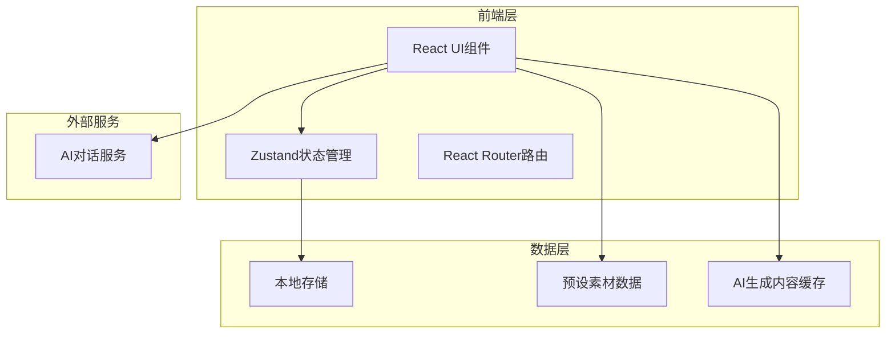
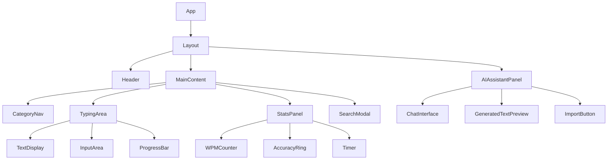

# 在线打字练习网站 - 技术架构文档

## 1. 架构设计



---

## 2. 技术说明

### 前端技术栈
- **框架**: React 18 + TypeScript
- **构建工具**: Vite
- **样式方案**: Tailwind CSS 3
- **状态管理**: Zustand
- **路由**: React Router DOM
- **图标**: Lucide React
- **动画**: Framer Motion

### 数据存储
- **预设素材**: 内置于前端代码中，按分类组织
- **用户数据**: LocalStorage 存储（AI生成内容、练习记录、偏好设置）
- **AI服务**: 通过API调用外部AI服务生成内容

---

## 3. 路由定义

| 路由 | 用途 |
|-----|------|
| `/` | 主页面，包含打字练习区、素材导航、AI助手 |
| `/practice/:category` | 指定分类的练习页面 |
| `/practice/:category/:id` | 指定素材的练习页面 |

---

## 4. 数据模型

### 4.1 素材数据结构

```typescript
// 素材分类
interface Category {
  id: string;
  name: string;
  icon: string;
  description: string;
  style: CategoryStyle;
}

// 分类样式配置
interface CategoryStyle {
  fontFamily: string;
  lineHeight: number;
  backgroundDecoration: string;
  theme: 'literary' | 'lyrics' | 'academic' | 'dialogue' | 'cards';
}

// 打字素材
interface TypingMaterial {
  id: string;
  categoryId: string;
  title: string;
  content: string;
  source?: string;
  difficulty: 'easy' | 'medium' | 'hard';
  wordCount: number;
  language: 'zh' | 'en' | 'mixed';
  tags: string[];
}

// AI生成素材
interface AIGeneratedMaterial extends TypingMaterial {
  prompt: string;
  createdAt: string;
  isFavorite: boolean;
}
```

### 4.2 练习记录数据结构

```typescript
// 练习会话
interface PracticeSession {
  id: string;
  materialId: string;
  startTime: string;
  endTime?: string;
  wpm: number;
  accuracy: number;
  errorCount: number;
  duration: number;
  completed: boolean;
}

// 用户设置
interface UserSettings {
  theme: 'light' | 'dark' | 'auto';
  fontSize: number;
  soundEnabled: boolean;
  showHints: boolean;
}
```

### 4.3 AI对话数据结构

```typescript
// AI对话消息
interface AIMessage {
  id: string;
  role: 'user' | 'assistant';
  content: string;
  timestamp: string;
}

// AI对话会话
interface AIConversation {
  id: string;
  messages: AIMessage[];
  createdAt: string;
}
```

---

## 5. 组件架构

### 5.1 核心组件



### 5.2 组件职责

| 组件 | 职责 |
|-----|------|
| `App` | 应用入口，路由配置 |
| `Layout` | 页面布局，响应式处理 |
| `Header` | Logo、搜索、AI助手入口 |
| `CategoryNav` | 素材分类导航 |
| `TypingArea` | 打字练习主区域 |
| `TextDisplay` | 原文显示，错字高亮 |
| `InputArea` | 用户输入框 |
| `StatsPanel` | 实时统计面板 |
| `AIAssistantPanel` | AI对话侧边栏 |
| `SearchModal` | 全站搜索弹窗 |

---

## 6. 状态管理

### 6.1 Zustand Store 结构

```typescript
// 素材状态
interface MaterialStore {
  categories: Category[];
  currentCategory: string;
  currentMaterial: TypingMaterial | null;
  materials: Record<string, TypingMaterial[]>;
  aiGeneratedMaterials: AIGeneratedMaterial[];
  
  setCurrentCategory: (categoryId: string) => void;
  setCurrentMaterial: (material: TypingMaterial) => void;
  addAIGeneratedMaterial: (material: AIGeneratedMaterial) => void;
}

// 练习状态
interface PracticeStore {
  isTyping: boolean;
  startTime: number | null;
  typedText: string;
  errors: number[];
  wpm: number;
  accuracy: number;
  
  startTyping: () => void;
  updateTypedText: (text: string) => void;
  resetPractice: () => void;
  completePractice: () => PracticeSession;
}

// AI助手状态
interface AIStore {
  isOpen: boolean;
  messages: AIMessage[];
  isGenerating: boolean;
  generatedText: string | null;
  
  togglePanel: () => void;
  addMessage: (message: AIMessage) => void;
  setGenerating: (status: boolean) => void;
  setGeneratedText: (text: string | null) => void;
}

// 搜索状态
interface SearchStore {
  isOpen: boolean;
  query: string;
  results: SearchResult[];
  
  toggleSearch: () => void;
  setQuery: (query: string) => void;
  search: (query: string) => void;
}
```

---

## 7. AI服务集成

### 7.1 AI生成接口

```typescript
interface AIService {
  // 生成打字素材
  generateMaterial(params: {
    category: string;
    topic?: string;
    language: 'zh' | 'en' | 'mixed';
    difficulty: 'easy' | 'medium' | 'hard';
    wordCount: number;
    style?: string;
  }): Promise<TypingMaterial>;
  
  // 对话生成
  chat(message: string, context?: AIMessage[]): Promise<string>;
  
  // 修改已生成内容
  modifyContent(content: string, instruction: string): Promise<string>;
}
```

### 7.2 AI提示词模板

```typescript
const AI_PROMPTS = {
  novel: '生成一段{difficulty}难度的{topic}主题小说段落，字数约{wordCount}字，风格治愈温暖...',
  lyrics: '生成{topic}主题的歌词，字数约{wordCount}字...',
  essay: '生成一篇四六级{topic}主题作文，字数约{wordCount}字...',
  translation: '生成一段{topic}主题的中英翻译练习...',
  vocabulary: '生成{count}个四六级高频{topic}相关单词...',
  dialogue: '生成{source}影视剧的经典台词...',
  customer: '生成电商客服{scenario}场景的标准话术...'
};
```

---

## 8. 文件结构

```
src/
├── components/
│   ├── layout/
│   │   ├── Header.tsx
│   │   ├── Layout.tsx
│   │   └── Sidebar.tsx
│   ├── typing/
│   │   ├── TypingArea.tsx
│   │   ├── TextDisplay.tsx
│   │   ├── InputArea.tsx
│   │   └── ProgressBar.tsx
│   ├── stats/
│   │   ├── StatsPanel.tsx
│   │   ├── WPMCounter.tsx
│   │   ├── AccuracyRing.tsx
│   │   └── Timer.tsx
│   ├── category/
│   │   ├── CategoryNav.tsx
│   │   └── CategoryTab.tsx
│   ├── ai/
│   │   ├── AIAssistantPanel.tsx
│   │   ├── ChatInterface.tsx
│   │   └── GeneratedTextPreview.tsx
│   ├── search/
│   │   ├── SearchModal.tsx
│   │   └── SearchResultItem.tsx
│   └── ui/
│       ├── Button.tsx
│       ├── Modal.tsx
│       └── Card.tsx
├── data/
│   ├── categories.ts
│   ├── novels.ts
│   ├── lyrics.ts
│   ├── essays.ts
│   ├── translations.ts
│   ├── vocabulary.ts
│   ├── dialogues.ts
│   └── customerService.ts
├── hooks/
│   ├── useTyping.ts
│   ├── useStats.ts
│   ├── useAI.ts
│   └── useSearch.ts
├── stores/
│   ├── materialStore.ts
│   ├── practiceStore.ts
│   ├── aiStore.ts
│   └── searchStore.ts
├── types/
│   └── index.ts
├── utils/
│   ├── calculateWPM.ts
│   ├── calculateAccuracy.ts
│   └── storage.ts
├── pages/
│   └── Home.tsx
├── App.tsx
├── main.tsx
└── index.css
```

---

## 9. 性能优化策略

### 9.1 代码分割
- AI助手面板懒加载
- 搜索弹窗懒加载
- 按分类懒加载素材数据

### 9.2 缓存策略
- 预设素材使用静态导入
- AI生成内容缓存到LocalStorage
- 练习记录定期清理（保留最近100条）

### 9.3 渲染优化
- 使用React.memo优化频繁更新的组件
- 打字输入使用防抖处理
- 统计数据使用useMemo缓存计算结果

---

## 10. 部署说明

### 10.1 构建命令
```bash
npm run build
```

### 10.2 部署方式
- 静态文件部署到任意静态服务器
- 推荐使用 Vercel、Netlify 或 GitHub Pages
- 支持PWA离线使用（可选）

### 10.3 环境变量
```env
VITE_AI_API_URL=AI服务API地址
VITE_AI_API_KEY=AI服务密钥（可选）
```